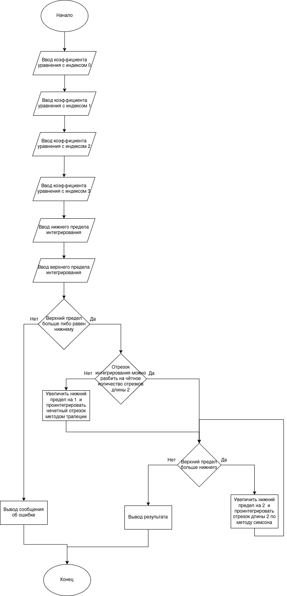

# Simpson-s-rule-Verilog
Построение синхронного цифрового автомата для реализации метода Симсона с дальнейшей загрузкой на ПЛИС Artix-7 xс7a100tcsg324-1I

## Проектирование системы
Для тестовой проверки системы на работоспособность перед её реализацией на языке описания аппаратуры Verilog была реализована программа на языке программирования C (Вся логика работы строго идентична, в том числе механизмы аппроксимации). Ниже представлена проксхема алгоритма:

## Верификация
С помощью релизовонного кода на языке C были получены эталонные значения, для более быстрой и удобной верификации был реализован модуль tb.v с task. 

